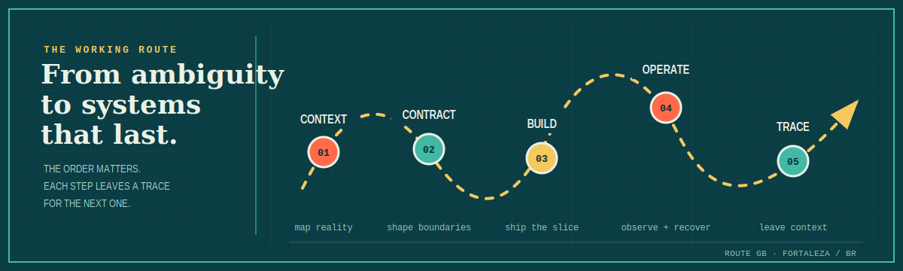

  

  <a href="https://gabrielbezerra.com.br/">Portfolio</a>
  ·
  <a href="#selected-work">Selected work</a>
  ·
  <a href="#commit-invaders">Commit Invaders</a>
  ·
  <a href="#connect">Connect</a>

## I build useful systems — and leave clear traces

I am a software engineer from Fortaleza, Brazil. My strongest base is in APIs, distributed systems and integrations, but I work across the whole problem: understanding the workflow, shaping the product, shipping the software and making it easier to operate and evolve.

Lately, I have been focused on **developer tools, local-first software, living documentation and practical AI workflows** — especially where better context and automation can remove friction without lowering the engineering bar.

## The working route

  

## Selected work

- **[Helix](https://github.com/gabrigabs/desktop-agent)** — a keyboard-first macOS copilot built with Tauri, Rust, React and a local agent runtime.
- **[Peria](https://github.com/gabrigabs/peria)** — a source-backed technical wiki generator that turns backend repositories into living documentation and agent context.
- **[Blueprint Flow](https://github.com/gabrigabs/pi-blueprint-flow)** — a visual cockpit for moving agentic development from research and specification through implementation and review.
- **[Agentic Development Guide](https://github.com/gabrigabs/agentic-dev-guide)** — an open reference on agents, context, memory, guardrails, evals and reusable engineering templates.

## Engineering range

| Area | Tools and concerns |
| --- | --- |
| Backend systems | TypeScript, Node.js, NestJS, Java, Spring, REST APIs, queues and integrations |
| Product surfaces | React, internal tools, desktop UX, Tauri and workflow design |
| Data and operations | PostgreSQL, Redis, RabbitMQ, AWS, Docker, observability and automated tests |
| Applied AI | Agent runtimes, context engineering, MCP, tool use, evals and living documentation |

## Commit Invaders

  <picture>
    <source media="(prefers-color-scheme: dark)" srcset="https://raw.githubusercontent.com/gabrigabs/gabrigabs/output/commit-invaders-dark.svg" />
    <source media="(prefers-color-scheme: light)" srcset="https://raw.githubusercontent.com/gabrigabs/gabrigabs/output/commit-invaders.svg" />
    
  </picture>

The game is regenerated daily from my public contribution graph.

## Connect

- **Portfolio:** [gabrielbezerra.com.br](https://gabrielbezerra.com.br/)
- **GitHub:** [@gabrigabs](https://github.com/gabrigabs)
- **Good conversations:** product engineering, backend systems, developer tooling, automation, applied AI and software quality
