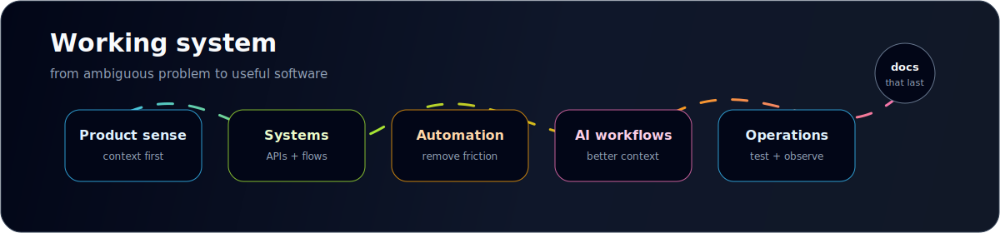

  

  <a href="https://gabrielbezerra.com.br/">Portfolio</a>
  ·
  <a href="https://github.com/gabrigabs?tab=repositories">Repositories</a>
  ·
  <a href="#working-system">Working system</a>
  ·
  <a href="#signal">Signal</a>
  ·
  <a href="#contact">Contact</a>

---

## About

I am a software engineer with a generalist profile, focused on building systems, internal products, automations and tools that help people and teams work better.

My strongest base is in APIs, distributed systems and integrations, but I like working across the full problem: understanding context, shaping the solution, writing the software, improving the user experience, automating repetitive work and leaving enough documentation for the next person to move with confidence.

Recently, I have been exploring AI-assisted engineering, agents, repository context, living documentation and workflows that connect research, specification, implementation and review.

## Working System

  

| Mode | How it shows up |
| --- | --- |
| Product-aware | I like understanding the real workflow before choosing the technical shape. |
| Automation-minded | I look for repetitive work, hidden handoffs and places where better tooling can remove friction. |
| System-focused | I care about APIs, integrations, queues, observability, tests and clear operational behavior. |
| AI-pragmatic | I use AI workflows to improve speed and context quality without dropping engineering discipline. |

## Stack and Tools

TypeScript, Node.js, NestJS, React, Java, Spring, PostgreSQL, Redis, RabbitMQ, AWS, Docker, GitHub Actions, automated tests and AI-assisted engineering workflows.

## Signal

  
  

  

  <picture>
    <source media="(prefers-color-scheme: dark)" srcset="https://raw.githubusercontent.com/gabrigabs/gabrigabs/output/github-snake-dark.svg" />
    <source media="(prefers-color-scheme: light)" srcset="https://raw.githubusercontent.com/gabrigabs/gabrigabs/output/github-snake.svg" />
    
  </picture>

## Current Direction

I am most interested in projects that mix software engineering, internal-tool UX, automation and practical AI. The goal is straightforward: build systems that solve concrete problems, stay easy to evolve and leave useful traces for whoever works on them next.

<strong>Public projects in standby</strong>

Some public repositories are labs, proofs of concept or ideas still taking shape. I keep them here as a quiet reference for what I am exploring, not as a polished product showcase.

| Project | Status | Theme |
| --- | --- | --- |
| [Peria](https://github.com/gabrigabs/peria) | Evolving | Living technical documentation, OpenAPI references, releases, GitHub roadmap and agent context. |
| [Blueprint Flow](https://github.com/gabrigabs/pi-blueprint-flow) | Lab | Web cockpit for agentic development, from research to review. |
| [Agentic Dev Guide](https://github.com/gabrigabs/agentic-dev-guide) | Reference | Open guide about agents, context, memory, guardrails, evals and working templates. |
| [Backend/API labs](https://github.com/gabrigabs?tab=repositories&q=api&type=&language=&sort=) | Standby | Experiments with APIs, queues, consumers, uploads and services across different stacks. |

## Contact

- Portfolio: [gabrielbezerra.com.br](https://gabrielbezerra.com.br/)
- GitHub: [@gabrigabs](https://github.com/gabrigabs)
- Location: Fortaleza, Brazil
- Good topics: product, engineering, automation, tooling, applied AI and software quality.
